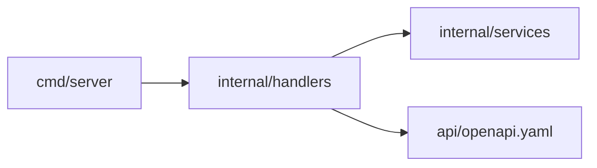

# Architecture

The contract arrow means handlers implement the contract; it is not a runtime dependency.

`services` holds pure business rules. `handlers` validates transport input and serializes results. `cmd/server` owns configuration, structured lifecycle logs, and graceful shutdown. Tests under `internal/architecture` parse imports and enforce an allowlist: services have no internal dependencies, handlers may import services, and cmd may import handlers. Services additionally cannot import net/http or its subpackages. New layers require an explicit rule update and review.

GET /healthz is a liveness endpoint. GET /api/v1/estimate accepts one integer points parameter from 1 through 100. A point represents four illustrative hours. No persistence, users, authentication, or external AI calls exist in the sample.

When extending into a product, place the React/TypeScript client in frontend/, add an approved chi router when useful, and introduce storage behind service interfaces. Include contract tests at each new boundary. Avoid abstractions without a second use case.

The OpenAPI file is a reviewable contract. Handler tests currently verify key behavior; there is no automatic OpenAPI conformance validator. Add one when adopting a contract validation dependency.
