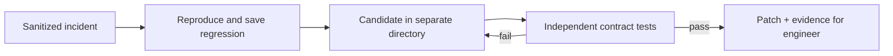

# Incident-driven repair rehearsal

The frontier idea is an engineering environment that initiates bounded work from observed failures and produces evidence-backed repair proposals. Engineers specify desired behavior and review decisions; the system handles reproduction, experiments, and verification.

```sh
make frontier-demo
```

No credentials or dependencies required. This runs real Go subprocess tests and creates a unique `repair-run-*` directory here containing source snapshots, evaluator logs, a candidate SHA-256, `proposal.patch`, and `report.json`. Repeated runs preserve prior evidence. Artifacts are ignored by Git. Run `make check` to test the loop itself.

## Watch the gates work

1. A synthetic incident reports that 100 points should yield 400 hours, but the deliberately broken fixture rejects it. The actual backend stays unchanged.
2. The harness checks the old test still passes, then converts the incident into a regression test and reproduces the failure.
3. Proposal one accepts all inputs. It fixes the incident but violates the independent contract, so the evaluator rejects it.
4. Proposal two fixes the boundary comparison. It passes the replay and the evaluator's 301 cases.
5. The harness writes a patch and a structured evidence report, then stops at `ready-for-review`.



The two proposals are recorded fixtures. There is no live model, diagnosis, adaptive retry, production telemetry connection, automatic merge, or deployment. The example demonstrates executable orchestration, not autonomous intelligence. The replay test is generated from a typed observation; the contract comes from a separate evaluator rather than the proposed fix.

## Where a real agent plugs in

Replace the recorded proposal list with a provider that receives the sanitized incident, current source, allowed edit scope, and feedback from its previous rejected proposal. It returns candidate source only. Keep a strict attempt/time/cost budget. Store provenance (model, prompt revision, base commit) alongside each candidate hash. A real implementation should make that provider an interface and test it with the recorded proposals before enabling paid calls.

This demo compiles only known fixture code. Separate directories prevent accidental checkout edits but ARE NOT a security sandbox. Do not feed arbitrary model-produced Go into this local runner: Go tests execute code with the runner's privileges. Before connecting a live proposer, execute candidates in an externally enforced disposable sandbox with no secrets, restricted network, resource limits, and evaluator-owned checks inaccessible to the proposer. Persist independent results outside that sandbox. Candidate hashes identify source; they do not attest trust.

## Pushing it further

- **Incident to proposed repair:** subscribe to sanitized error clusters, deduplicate incidents, replay against an ephemeral service, and open a draft PR only when authorized. The human supplies expected behavior when telemetry cannot establish it.
- **Parallel hypotheses:** for sufficiently hard tasks, compare independent candidate fixes under the same evaluator. Budget experiments and choose on behavior and review cost. No agent delegation runs in this example.
- **Shadow verification:** replay sanitized traffic against the candidate and compare outputs, latency, and resource use before a release decision.
- **Learning environment:** promote approved incident regressions into the permanent suite. Propose improvements to instructions and tools as separately reviewed changes evaluated on held-out tasks.
- **Bounded release autonomy:** after review and explicit policy setup, use a canary with enforced abort thresholds and a tested rollback. A passing local test suite alone must not authorize deployment.

The exciting change is that the environment can discover and validate work, with an inspectable chain from observation to candidate to decision. Agent outcome evaluation and durable progress artifacts are informed by [Anthropic's evaluation guidance](https://www.anthropic.com/engineering/demystifying-evals-for-ai-agents) and [long-running harness design](https://www.anthropic.com/engineering/effective-harnesses-for-long-running-agents). This specific repair demo is our own design.
